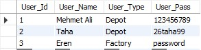

# Resource Management System

An application that will help a factory to continue working efficiently and regularly.
(Resource Management Part of Employee Control & Resource Management System.)

Resources Management:
1.	Storing material information.
2.	Adding, removing, editing Materials.
3.	Multiple storage management.
4.	Keeping records of material entry/exit to the Storage.

### Running

1.	Create two databases using scripts in the db_files file. Separate scripts for create, insert and procedures can be used, or a single dump file can be used to create databases.
2.	Change the MySql Server connection information in the application's configurations.

3.	If the settings are made correctly, one can easily enter the application by using the following user information.
 
4.	Mehmet Ali and Taha can access Resource Management. Eren can access Employee Management.
5.	Files in item_files folder can be used to test the multi-adding feature in item management form. 

## License

This project is licensed under the MIT License - see the [LICENSE.md](LICENSE.md) file for details